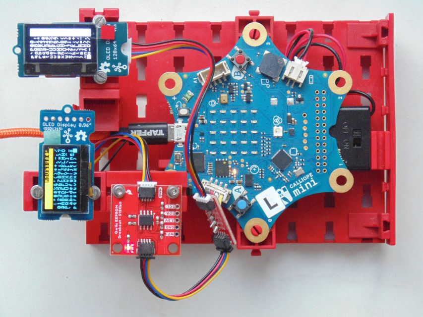
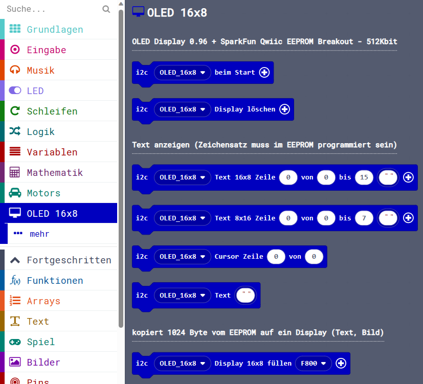
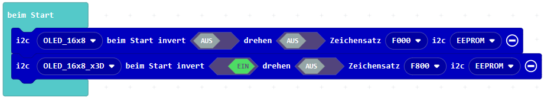
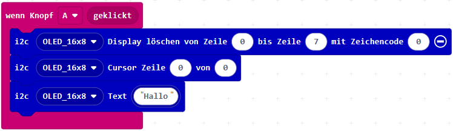
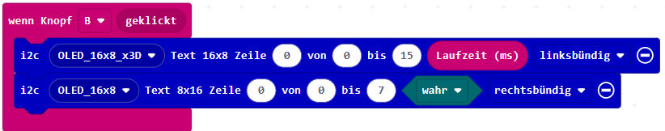
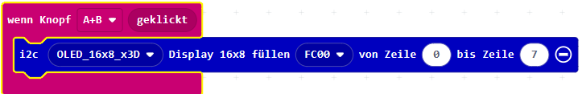

> Diese Seite bei [https://calliope-net.github.io/oled-16x8/](https://calliope-net.github.io/oled-16x8/) öffnen.

> Zum Programmieren des EEPROM die Erweiterung [**calliope-net/oled-eeprom**](https://calliope-net.github.io/oled-eeprom/) verwenden.

### Calliope Erweiterung für i2c OLED Displays, Zeichensatz im EEPROM:

> OLED neu gedacht - 2 Displays gleichzeitig - EEPROM - 1 Stecker - i2c-Bus

> Querformat 16x8 - Hochformat 8x16 - 2x16x8=256 Zeichen auf einen Blick

> mehrere Zeichensätze je 256 Zeichen und Platz für Bilder im EEPROM

> Calliope funktioniert mit jeder (Speicher-) Konfiguration und Version (ab 1.3)

 
### Calliope Erweiterung für die i2c Module:

* [Grove - OLED Display 0.96 inch](https://wiki.seeedstudio.com/Grove-OLED_Display_0.96inch/)
* [Grove - OLED Yellow&Blue Display 0.96(SSD1315)](https://wiki.seeedstudio.com/Grove-OLED-Yellow&Blue-Display-0.96-SSD1315_V1.0/)
<!--
_V1.0/img/10402049_Preview-07.png)
-->
* [SparkFun Qwiic EEPROM Breakout - 512Kbit](https://www.sparkfun.com/products/18355)
* [Qwiic Cable - Grove Adapter](https://www.sparkfun.com/products/15109)
<!--

-->

Dieses Repository kann als **Erweiterung** in MakeCode hinzugefügt werden.

* öffne [makecode.calliope.cc](https://makecode.calliope.cc)
* klicke auf eine Projektvorlage
* klicke unter dem Zahnrad-Menü auf **Erweiterungen** (oder bei den Blöcken ganz unten)
* kopiere die folgende **Projekt-URL** in die Zwischenablage (Strg-C)
* **calliope-net/oled-16x8**
* füge sie auf der Webseite oben ein (Strg-V) und klicke auf die Lupe (oder ENTER)
* wenn die Erweiterung gefunden wurde, klicke auf das Rechteck
* jetzt hat die Liste den neuen Eintrag **OLED 16x8** bekommen

### Beschreibung der Erweiterung für 'Grove - OLED Display'

Der vorhandene Code für OLED Displays wurde bezüglich i2c-Bus-Kommunikation so stark optimiert,
dass davon nichts übrig blieb. Die Menge der über den i2c Bus übertragenen Bytes wurde erheblich reduziert,
und der zusätzliche Verkehr mit dem EEPROM führt zu keiner Verzögerung.

Bei dem neueren Yellow&Blue Display kann die i2c Adresse durch überbrücken von D/C und VCC von 0x3C in 0x3D geändert werden.
So können 2 Displays angeschlossen werden und insgesamt 256 Zeichen gleichzeitig anzeigen. Es ist aber auch möglich,
mehrere Displays mit gleichen i2c Adressen parallel zu schalten, die dann das gleiche Bild anzeigen. Das gelingt, weil
keine Daten zurück gelesen werden (können). Die Farben Yellow&Blue sind fest: 1/4 (2 Zeilen) sind gelb und 3/4 (6 Zeilen) sind blau.

### Blöcke

#### beim Start

Der Block muss für jedes Display aufgerufen werden. Dabei ist die richtige i2c Adresse einzustellen.
Mit optionalen Parametern kann eingestellt werden:
* **invert** stellt ein, ob die Zeichen leuchten oder der Hintergrund.
* **drehen** stellt das Display auf den Kopf, wenn es anders herum eingebaut ist.
* **Zeichensatz** Anfangsadresse im EEPROM. Von hier werden 2048 Bytes für 256 Zeichen-Codes verwendet.
  Jedes Display kann einen anderen Zeichensatz benutzen. Im Beispiel ist für das Display im Hochformat 8x16
  ein Zeichensatz eingestellt, der auch 1/4 gedrehte Zeichen enthält. Die Anfangsadresse im EEPROM wird
  der i2c Adresse zugeordnet und gespeichert (bis 'beim Start' erneut aufgerufen wird).
* **i2c** Die i2c Adresse des EEPROM muss normalerweise nicht geändert werden.
  
#### Display löschen, Cursor, Text

Ohne optionale Parameter wird das gesamte Display gelöscht. Tatsächlich werden 128 Leerzeichen geschrieben.
Es können einzelne Zeilen gelöscht und ein anderes Zeichen angegeben werden, mit dem die Zeilen gefüllt werden.

Der Cursor kann an eine Stelle gesetzt werden und Text wird ab Cursorpasition geschrieben.
Der Parameter Text ist vom Typ *any* und nimmt auch Blöcke vom Typ *number* oder *boolean*.

#### Text in einen *festen Bereich* schreiben

Es gibt 2 Blöcke **Text 16x8** und **Text 8x16**, die benutzt werden müssen wie das Display eingebaut ist (Querformat oder Hochformat).
Der Block positioniert immer den Cursor und schreibt immer genau die festgelegte Anzahl Zeichen. Wenn der Text zu lang ist, wird er abgeschnitten.
Ist der Text zu kurz, wird hinten oder vorne mit Leerzeichen aufgefüllt. In der nächsten Zeile wird *nicht* weiter geschrieben.
So können viele Messwerte ihren *festen Bereich* auf dem Display haben.

Der *feste Bereich* wird durch die Zeile und die Anfangs- und End-Position in der Spalte definiert - nicht durch die Länge.
So können übersichtlich mehrere Werte von 0 bis 3, der nächste von 4 bis 9 und der letzte von 10 bis 15 definiert werden.

Der Parameter Text ist vom Typ *any* und nimmt auch Blöcke vom Typ *number* oder *boolean*.

#### EEPROM direkt auf Display kopieren

Genau wie beim Löschen können auch Bytes aus dem EEPROM einfach auf das Display kopiert werden. Der Speicherbereich mit
dem Zeichengenerator schreibt dann alle Zeichen in der Reihenfolge ihres Zeichencodes auf das Display. Und weil 128 Zeichen
drauf passen, ist das der ganze (ASCII-) Zeichensatz. Es kann auch jede Zeile einzeln aus einem anderen Speicherbereich 
geholt werden. Auch Bilder können damit angezeigt werden, aber die müssen vorher erst mal in den EEPROM programmiert werden.

### Erweiterungen

> [Upates für Erweiterungen; Erweiterungen aus einem Projekt löschen.](https://calliope-net.github.io/i2c-test#updates)

> [Alle i2c-Erweiterungen für MakeCode von calliope-net (Software).](https://calliope-net.github.io/i2c-test#erweiterungen)

#### Calliope-Apps, .hex-Dateien, Bildschirmfotos mit Blöcken

> [Alle Beispiel-Projekte für MakeCode von calliope-net (Calliope-Apps).](https://calliope-net.github.io/i2c-test#programmierbeispiele)

> GitHub-Profil calliope-net: [https://github.com/calliope-net](https://github.com/calliope-net)

### Bezugsquellen

> [Alle i2c-Module und Bezugsquellen (Hardware).](https://calliope-net.github.io/i2c-test#bezugsquellen)

#### Metadaten (verwendet für Suche, Rendering)

* Calliope mini
* i2c
